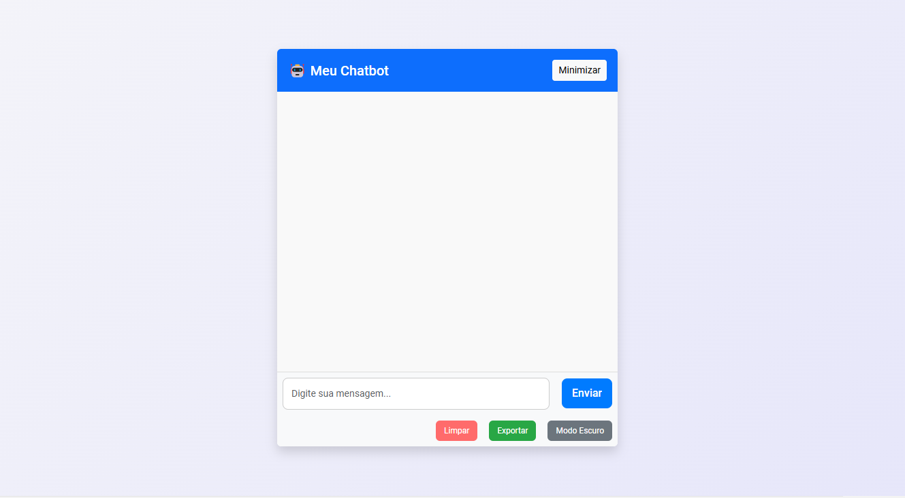
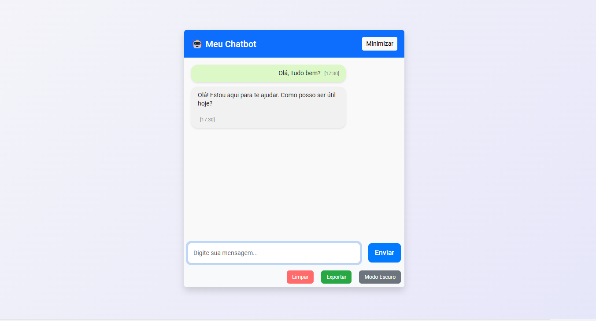

# 💬 MeuChat - Chatbot com Inteligência Artificial


Um chatbot moderno com integração à **API da OpenAI**, desenvolvido para fornecer respostas rápidas e precisas.

---

## 🚀 Tecnologias Utilizadas

As principais tecnologias e ferramentas utilizadas neste projeto foram:

-  **HTML5**  
-  **CSS3**  
-  **JavaScript**  
-  **PHP**  
-  **Composer**  
-  **OpenAI API**  

---

## 🌐 Acesse o Chat

O projeto está hospedado em:

🔗 **[ronnysenna.com.br/chat](https://ronnysenna.com.br/chat)**

---

## 📸 Screenshots

Adicione capturas de tela do projeto aqui. Exemplo:

1. **Tela Inicial do Chat:**
   

2. **Exemplo de Conversa:**
   

---

## 🛠️ Funcionalidades

- ✅ **Interface Simples e Responsiva**  
- ✅ **Modo Escuro/Claro** com botão de alternância  
- ✅ **Histórico de Conversas**  
- ✅ **Exportação do Chat** em formato JSON  
- ✅ **Limpeza do Histórico** com um clique  
- ✅ **Efeitos Visuais** com animações CSS  
- ✅ **Som de Notificação** ao receber respostas  

---

## ⚙️ Configuração do Projeto

### **Pré-requisitos**
- PHP 7.4+  
- Composer  
- Servidor com suporte a PHP (exemplo: XAMPP, Hostinger, etc.)

### **Instalação**

1. Clone o repositório:
   ```bash
   git clone https://github.com/seu-usuario/MeuChat.git
